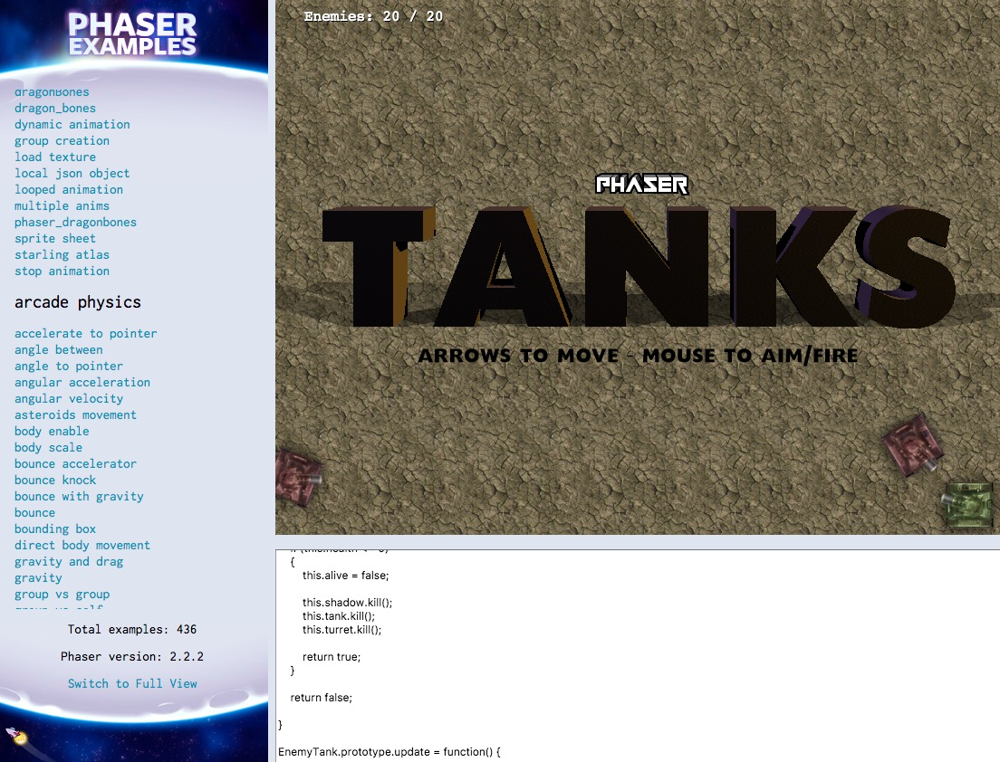
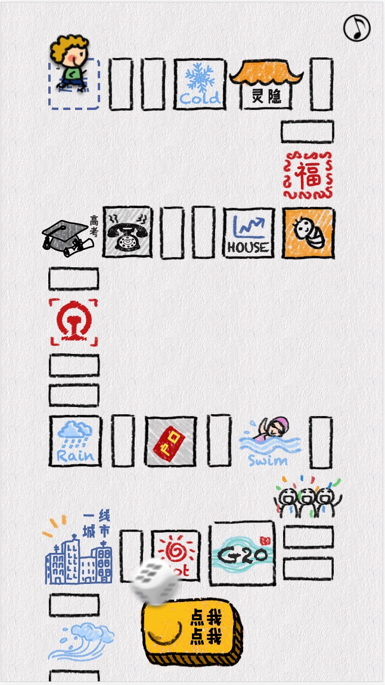
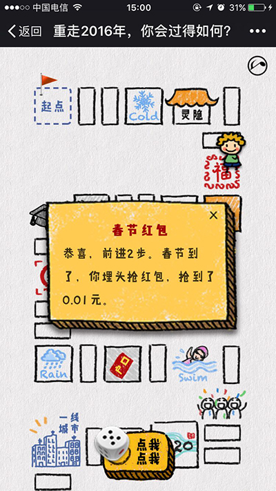
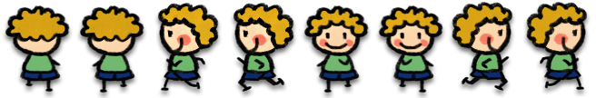
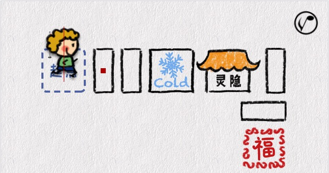
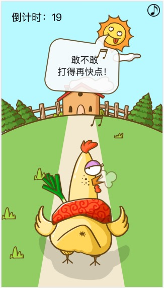
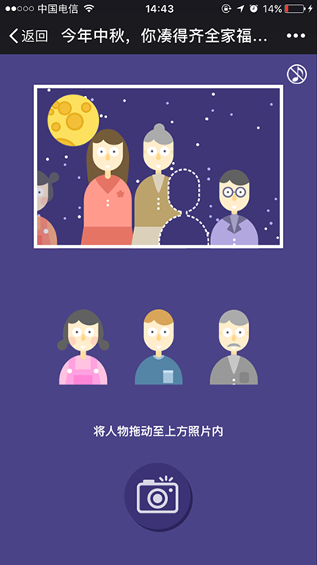
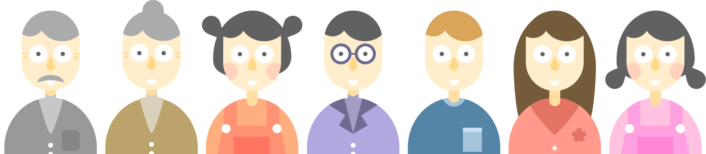

phaser h5小游戏项目集锦
===========================

之前写了一篇[我做过的h5](https://github.com/yuwanli/collection-mobile-page/blob/master/README.md)，就是按照使用的库做了一个分类，有一类就是phaser类，这个是我有一段时间里常用也非常爱用的一个游戏框架。

简单说下[phaser](https://github.com/photonstorm/phaser)吧，这个框架是我老大推荐我使用的，是他先开始使用的，他让我有时间就看看这个框架。对于一个前端菜鸟来说，我选择框架的基本原则就是，先入为主，能用，方便用，好用即可。简单的说就是有丰富的示例及代码，然后有完善的文档和社区供解决具体问题。phaser就有我说的这些，但是刚开始使用的时候，存在的问题是，示例是在线示例，查看的时候加载需要很长时间，等待时间略长。后来找到了这个[phaser-examples](https://github.com/photonstorm/phaser-examples/)，可以在本地配一个简单的服务器，本地运行demo，这样可以快速查看示例和源码。



那这里解释下，为啥最近我开始疯狂的写readme文档，是我开始发现这个东西的重要性，今年离职了几个前端，好多他们的代码交接到了我这里，在阅读和修改他们的代码的时候遇到了重重困难，不是说他们代码写的不好(确实有些写的不好/捂脸)，而是每个前端的代码风格会有差异，特别是没有注释习惯的情况下(我就不太会给很详细的注释)，代码的维护性和可读性就会变的很差。还有一个很重要的原因是，自从参加了腾讯的2017年的前端大会以后，我就立志要成为一个有情怀的前端老大哥(目前还只是前端小菜鸟)，所以希望readme的形式去和后来的前端去分享我做这个时候的想法、我的项目结构，我使用了哪些插件及使用的原因，当然还有遇到的一些问题，通过这样的一个方式把项目交接给下一个人。其实吧，个人觉得readme是使你写的项目变得有价值一个重要手段，如果没有好的readme，后期就不会有人愿意去查阅和维护你的项目代码，最终只会因为你的代码可读性和复用性太差导致弃用然后重写。由于公司的项目有保密协议，所以github上只能推readme和部分demo代码，当然我也会推一份到公司内部gitlab上，附有完整的源码(本人是本着分享和学习的态度，其实是希望能po上项目源码的，若有对源码有兴趣的可以私聊我)。

下面就是对具体的项目进行解析了，如果你已经是一个前端大神，请以查阅和检查错误的姿势来看下面的内容(/捂脸)。

### [2016年终策划-重走2016](http://mat1.gtimg.com/zj/yuwanli/dzw1612/news_yearPlan/index.html)






h5的需求：
    *  投骰子的方式决定行走多少步
    *  会有前进、后退和暂停
    *  有些隐藏的点，用于统计得出最后的结果(称号)

这里之所以把这个项目放在第一个讲，是因为我觉得这个项目达到了我预期的效果-可复用性，所以下面会说的比较详细。我做的h5中，这种互动类型的h5大多都是一次性的，不仅是代码还是互动形式的可复用性都较差，不适合复用，仅限一次使用。当时拿到这个需求的时候，我觉得这个互动形式上可以很好的进行复用，把能抽象出来的东西全部抽象到一个`data.js`文件中，所以项目结构上和代码实现上尽量保证复用性。

大家也可以想下，如果这样的一个需求的h5让你做，你会用什么样的方式去做这个h5，用什么样的框架和方式，如何去实现人物走到每个随机位置、及特殊位置的处理(前进后退)、结果的统计、人物的转向等等问题。

拿到这个的时候，我第一个想到的其实是用cocos creater(由于之前有了解过cosos的相关产品)，让我想到用这个的原因主要是因为，棋盘和地图形式的h5，觉得可以用这种可视化的方式开发，直接选点或者画框去确定一个区域，具体位置不用人为的去量。然后动画的编辑上，也能通过可视化的方式，而且可以在动画中，具体某一帧加入js代码(这个效果同[CreateJs初体验]()中的`test02.html`)，然后就是希望能尝试新的开发框架和开发形式。

差不多通过了一天的简单学习，开始尝试去做。但最终还是用了phaser，这不是对cocos creater的否定，只是因为自己功力不够，这种可视化的游戏开发，其实对开发者的要求很高，一个要有代码基础，然后就是游戏制作的基础，动画可视化编辑的基础。总之，我要是用这个做的话，肯定得花很多时间，而且一旦遇到问题，可能很难以下就能解决。在这种情况下，果断放弃。这里也是自己的一个原则，新的东西可以尝试，但一旦发现这个可能会严重影响到工作进度，且不是一下能吃下的东西，浅尝即止，了解下即可。


然后具体的phaser的使用上就是为了实现人物的运动(移动及转向)，和骰子的投掷，具体的可以查看[demo.html](news_yearPlan/demo.html)，这里人物做了先向右，然后向下的运动(人物的转向也会变)。然后骰子有个降落和反弹的物理效果，点击骰子有个向上抛掷的效果，再次点击有随机出现点数的效果。以上的这些效果也就本项目抽象出来的几个基本效果。

人物的动画及转向的变化主要通过播放帧的变化来实现，每个方向切成两帧，即左右左。



```javascript
//添加人物4个方向的动画
_this.player.animations.add("player_back",[0,1],5,true);
_this.player.animations.add("player_left",[2,3],5,true);
_this.player.animations.add("player_down",[4,5],5,true);
_this.player.animations.add("player_right",[6,7],5,true);

//先向右运动然后向左运动
var tween1 = _this.game.add.tween(_this.player).to({ x: this.circle2.x }, 4000, Phaser.Easing.Linear.None, true, 0, 0);
var tween2 = _this.game.add.tween(_this.player).to({ y: this.circle3.y }, 4000, Phaser.Easing.Linear.None, false, 0, 0);
tween1.onComplete.add(function(){_this.player.animations.play("player_down");},this)
tween1.chain(tween2);
```

然后人物的移动，通过phaser内置的tween函数来实现，demo中时间是固定的，具体实现的时候，可以从某一点运到到另一点的时间通过距离和速度来计算，这样就可以实现一个匀速运动的效果。但是最终使用了物理引擎，利用碰撞的效果来实现，人物的中线为一个碰撞线，另一个点为一个碰撞点，人物给一个固定方向的速度，运动这个点的时候即可停止再进行判断。前面说的通过距离来算的方式，存在的问题是，每次计算都会有误差，当运动次数多的时候，误差会被放大，最终会导致的效果就是人物，运动到的点不是预计中到达的位置。




那之前说的把棋盘上的点抽象出来是怎么做的呢，可以查看项目源码直接查看data.js文件，就能大概知道了。

```javascript
{//
    "x":"378",//xy为改点距离棋盘左上角定点的距离
    "y":"77",
    "dir":"player_right",//正向行走的时候，人物的转向
    "_dir":"player_left",//反向行走的时候，人物的转向
    "speak":'2',//气泡的类型(最右端，最顶端，最左端等特殊情况下，气泡出现的位置不一样)
    "text":"施主，\n馒头泡稀饭——\n粥润发",//气泡中的文字
    "result":"r8",//用于统计结果，该情况下会导致r8+1
    "alertInfo":{//隐藏点
        "h1":"灵隐寺",
        "p":"恭喜，前进2步。你喝了一碗灵隐寺的腊八粥，身心温暖。",
        "status":"2"//正数则前进对应步数，负数则后退对应步数，stop则暂停三秒
    }
}
```
这里把棋盘上的点抽象成一个对象，其中包含一个点的所有信息，渲染的时候并不是去把所有的点都渲染出来，渲染出来的永远只有一个点`collisionPlayer`，意思就是player要去碰撞的点，其实想象成踢皮球，人物行进4格，其实是一个前进函数运行了4次，皮球永远在下一个点，当人物到达这个点的时候，皮球就到下一个点了。需要后退的时候，会把方向变掉，这里要注意的是，在一些转折点的地方，正向和反向经过时播放人物动画的转向需要人为的去判断。所以，投骰得到一个数字以后，会把这个数值赋给一个变量num，然后去执行`godes()`函数，也就是行走到`collisionPlayer`所在的位置，然后`num--`，不为0的话继续执行，为0的话表示行走完毕，这个时候就去判断是否为隐藏点。需要前进的话，重新赋值`num`，然后执行`godes()`，若是后退的话，先改变方向值，然后执行`godes()`。

```javascript
_this.goDes = function(){
    _this.diceCan = false;//锁机制，行走过程中，不可投骰
    if(_this.num==0){//行走至目的地，
        var p = jsonData[_this.index];
        _this.diceCan = true;
        _this.initSpeak(p.speak,p);
        _this.walking = false;
        _this.collisionPlayer.x = 0;//important
        _this.collisionPlayer.y = 0;//important
        return
    }
    var p = jsonData[_this.index]
    if(_this.direction){//判断当前的运动方向
        _this.player.play(p.dir)
    }else{
        _this.player.play(p._dir)
    }
    if(_this.num>0){//前进
        _this.direction = true;
        _this.walking = true;


        _this.index++;
        _this.collisionPlayer.x = jsonData[_this.index].x/100*ratio+_this.left
        _this.collisionPlayer.y = jsonData[_this.index].y/100*ratio+_this.top
        var i = _this.index-1
        if(Math.abs(parseInt(jsonData[_this.index].x)-parseInt(jsonData[i].x))>0){
            if(parseInt(jsonData[_this.index].x)-parseInt(jsonData[i].x)>0){
                _this.player.body.velocity.x=_this.player_v;
            }else{
                _this.player.body.velocity.x=-_this.player_v;
            }
            _this.player.body.setSize(1,_this.player.height,-0.1*_this.player.width,0)//这里设置的是人物的碰撞线
        }else{
            _this.player.body.setSize(_this.player.width,1,0,0.1*_this.player.height)
            _this.player.body.velocity.y=_this.player_v
        }
        // _this.num-=1;
        // _this.goDes(callback)
    }
    if(_this.num<0){//前进
        _this.direction = false;
        _this.walking = true;
        _this.index--;
        _this.collisionPlayer.x = jsonData[_this.index].x/100*ratio+_this.left
        _this.collisionPlayer.y = jsonData[_this.index].y/100*ratio+_this.top
        var i = _this.index+1
        if(Math.abs(parseInt(jsonData[_this.index].x)-parseInt(jsonData[i].x))>0){
            if(parseInt(jsonData[_this.index].x)-parseInt(jsonData[i].x)>0){
                _this.player.body.velocity.x=_this.player_v
            }else{
                _this.player.body.velocity.x=-_this.player_v
            }
            _this.player.body.setSize(1,_this.player.height,-0.1*_this.player.width,0)

        }else{
            _this.player.body.setSize(_this.player.width,1,0,0.1*_this.player.height)
            _this.player.body.velocity.y=-_this.player_v
        }
        // _this.num+=1;
    }

}
```

结果的统计：通过隐藏点的result字段，给对应结果的num做加1的操作，游戏结束的时候，根据各种结果的num得出结果即可。

'再玩一次'，这个简单的做法是刷新页面，但是体验不好，这里我才用的做法是把一些相关的参数重置掉，然后再去执行`init`函数。

可以扫码体验下制作出来的效果，前面说的可复用性体现在，再次复用的时候，设计师只需重新画棋盘，编辑只需替换棋盘，然后去量每个点的位置(距离左上角定点的距离)，然后设置改点的相关属性即可。后来这个确实是复用过几次。


### [必胜客万圣节策划](http://zj.qq.com/money/ywl_game_halloween.htm)


这个项目的灵感也是来自之前有个很火的h5-[里约大冒险](http://d.news.163.com/active/2232636/olympic.html)，手动画一个小人，然后这个小人贯穿整个设定好的故事，然后故事中引导用户去画或者滑动屏幕，促使故事的行进。


h5需求：
    * 实现画图的功能
    * 根据画的图，生成一张图片
    * 动画节奏的把握

前面两个的话，查看demo[draw_game/demo.html]

```javascript
//maxX,minX,maxY,minY用于生成图片 确定边界线
function paint(pointer,x,y) {
    if(!ifDone){
        ifDone = true;
    }
    if(flag){
        beforeX=x;
        beforeY=y;
        flag = false;
    }
    if(init){
        maxX = x;
        minX = x;
        maxY = y;
        minY = y;
        init = false;
    }
    if(
        x<(winWidth-$(".drawCon").width())/2||
        x>winWidth-((winWidth-$(".drawCon").width())/2)||
        y<winHeight*0.2||
        y>winHeight*0.2+$(".drawCon").height()
    ){
        beforeX=x;
        beforeY=y;
        return;
    }
    bmd.line(beforeX, beforeY, x, y, '#5C5C5C',2);
    beforeX=x;
    beforeY=y;
    if(game.input.activePointer.position.x>maxX){
        maxX = x;
    }
    if(game.input.activePointer.position.x<minX){
        minX = x;
    }
    if(game.input.activePointer.position.y>maxY){
        maxY = y;
    }
    if(game.input.activePointer.position.y<minY){
        minY = y;
    }
}


//canvas 生成base64图片
bmd_draw = game.make.bitmapData(maxX-minX+4, maxY-minY+4);
var photo = bmd_draw.copy(bmd, minX-2,minY-2,  maxX-minX+4, maxY-minY+4,0,0,  maxX-minX+4, maxY-minY+4);
document.getElementById("draw_result1").setAttribute("src",photo.canvas.toDataURL());

```

然后动画的话，这里由于经验和时间的原因，没有找到一个更好的方式去控制动画，用了使用成本最低的css3和webkitAnimationEnd。


### [腾讯大浙网鸡年新春送福](http://mat1.gtimg.com/zj/yuwanli/dzw1702/product/index.html)




这个项目不管是设计上还是制作上都花了很多功夫，领导放手让我们去玩创意，没太多约束，所以才有这个魔性的h5，不管是设计风格上还是音乐及配音上，都奔着魔性去了，说实话，这个h5，大家玩的都挺嗨的，作为开发，我尽量的去实现他们的魔性的需求。

h5的需求：
    * 游戏的主要交互方式是拍打鸡屁股（点击屏幕）
    * 场景对鸡的速度变化也要做出相应的响应，比如鸡表情的变化，还有鸡说的话，草地的移动速度，太阳的表情等
    * 鸡要哼着音乐出场，所以有音符的飘动，然后还有速度很快的时候还的出现烟雾
    * 速度超过一个阈值或者游戏时间结束的时候鸡跑掉然后生出一个蛋
    * 蛋的出现所引发的一些列变化，如有人物及人物旁白的出现，太阳表情的变化，提示鸡的出现等
    * 亲吻蛋(双点触碰屏幕)的方式打开蛋，然后抽奖
    * 公司内部人员可抽取红包，通过企业号下发，外部人员可获得奖品

梳理一下需求，会发现很重要的一点就是拍打的速度，这里没有太去细化这个拍打的速度，只是通过计算两次点击的时间差来做的判断

```javascript
_this.chicken.events.onInputDown.add(function (target,event) {
    _this.currentTme = game.time.now;
    _this.diff = _this.currentTme-_this.prevTime;
    _this.prevTime = _this.currentTme;
    if(_this.diff<500){
        //时间差小于500则表示用户希望加快速度
    }else{
        //时间差小于500则表示用户希望减速
    }
})
```

速度的变化，这里是通过播放动画的速度，比如草地的速度，鸡的animation的速度等来响应点击速度的变化。

哼的音符，以及鸡跑的很快出现的烟雾效果，都是用到了游戏引擎里面的一个重要的概念-发射器。简单的理解的话就是我们常会玩的射击类游戏中的子弹。phaser里有一个`emitter`类，具体使用这里不展开说了，具体的可以参看demo或者phaser源码。

这里节奏的把控，动画的执行顺序是通过phaser内置的tween来实现的。

双点触碰屏幕这个呢，是项目结束的时候觉得这块不够魔性，希望用户真的去亲吻手机才能打开这个蛋，所以这里找了一个[hammerjs](http://hammerjs.github.io/)插件，来实现双点触碰的事件，不过效果是真的有人亲了手机，这还是一次很有趣的尝试。

```javascript
var myElement = document.getElementById('game');
var mc = new Hammer.Manager(myElement);
mc.add( new Hammer.Tap({ event: 'pinchstart', pointers: 2 }) );//两点触碰
mc.on("pinchstart", function(ev) {
    //此时则判断'亲吻蛋'了
});
```

抽奖这块逻辑就得后台去控制了，内部员工可抽红包，通过企业号下发，然后外部人员可抽奖品(当然由于活动结束，这里已经抽不到奖品了)，然后就是奖品的相关控制了。

可点击[http://mp.weixin.qq.com/s/n9SLBcP1iajzKop9Sq9-xw](http://mp.weixin.qq.com/s/n9SLBcP1iajzKop9Sq9-xw)查看有关这个项目的详细介绍，这个项目我觉得是玩的比较开心了。


### [2016中秋策划-凑齐全家福](http://zj.qq.com/zt2016/zqqjf/index.htm)



h5的需求
    * 人物可拖到相框中
    * 固定时间后人物会走掉
    * 按下快门可拍照生成照片

需求看上去还是很简单的，暂且撇开这个h5是否成功或是否有意义，我们就当是一个技术的题目，大家看上面的图可以想下怎么去实现，下面是我实际开发过程中遇到的问题：
    * 人物放的位置的定位，因为不同的人物，其实大小是不一样的，如何保证能放的很整齐
    * 放到相框中应该放在哪个位置，位置是固定的7个位置，如何保证不会重叠在一起
    * 待拖动的三个人物应该是哪三个人物，如何保证人物不会重复，一共7个人物，怎么保证7个人物循环使用不重复

至于第一个问题，这个可以从切图上解决这个问题，具体地方有个小技巧就是保证每个人人物的大小一致，摞在一起的时候需要重叠的部分保证重叠，这样就能保证了。可以尝试下把下面这个图7等分，然后放到ps里面摞起来放在一起应该就能明白我说的意思了。



由于篇幅原因(其实就是写的太累了)，这边就不做展开讲这个h5了，大家有什么问题可以留言。


这个写起来是真的有点累啊，写了我整整一下午，毕竟都是去年的项目了，要边看边想然后写。所以readme文档还是在开发过程中，或结束不久就去写这个readme文档，效率会高很多。

差点忘了，phaser中有几个我遇到的问题：

    * 版本的问题，phaser的版本态度了，更新的比较快，版本间存在兼容性的问题，应该说是版本和特定机型间的兼容问题，这个具体的我不太记得了。就是当发现有些事件在某些机型上不能用的时候，而且你测试过不是代码bug的时候，可以尝试下换下phaser的版本。
    * viewport的问题，这个大家看我源码的时候应该能发现，所有的phaser项目我都没有加viewport的meta，这里也是摸索出来的一个做法，我发现加了meta以后，canvas中的图片都会变得很模糊，而且这个跟图片精度没有关系。具体为什么去掉viewport的meta会让图片边清晰，我也还没知道原因，有知道这个原因的大神，可以留言告诉我一下。


